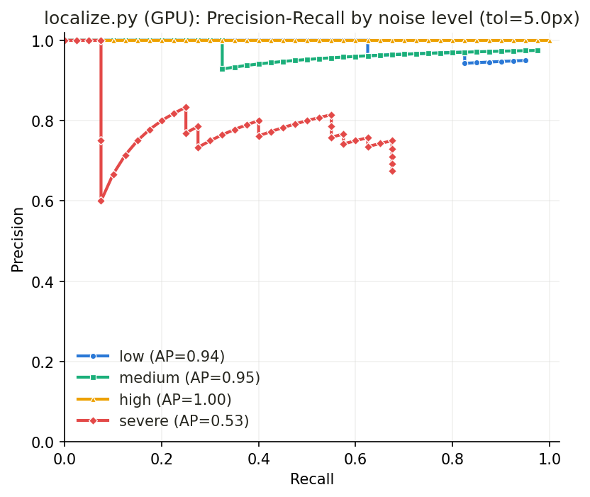
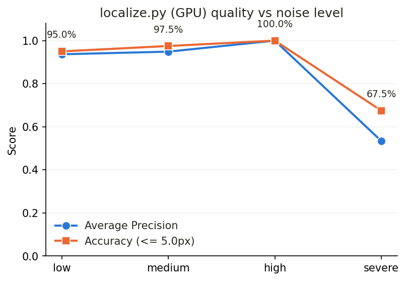
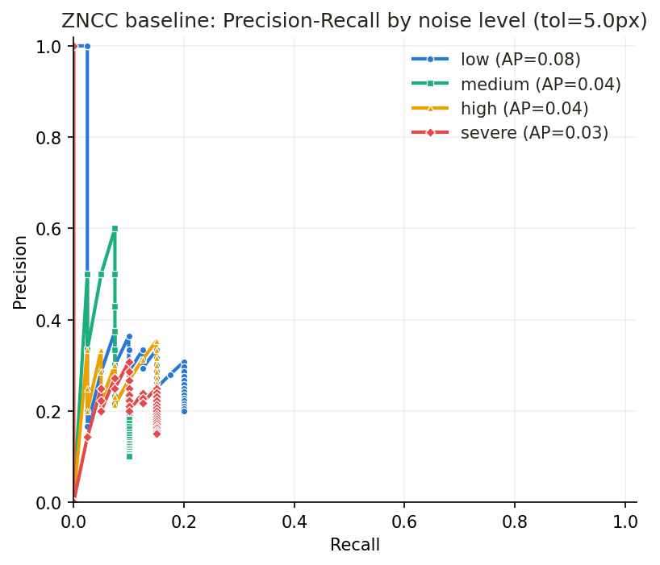
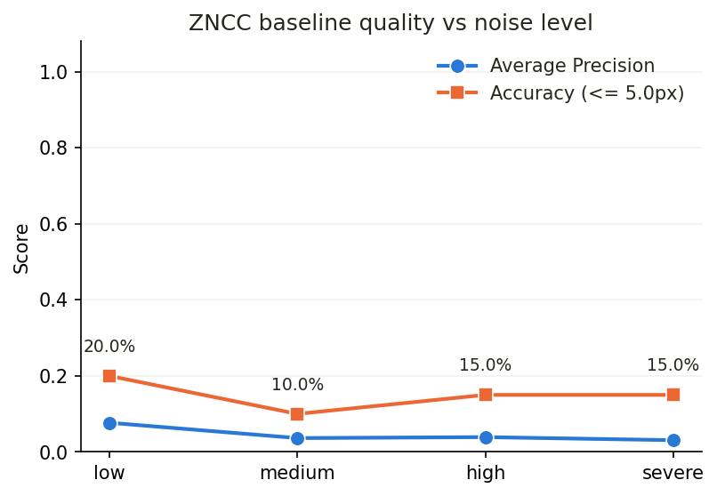

# Drift-Sense — Synthetic SEM Dataset Generator + GPU Localizer

Submission for the Applied Materials "Drift-Sense" problem statement
(SEMICON India Hackathon 2026 / i4C).

The hackathon ships no dataset, so this repository does both halves of the job:

1. **Generate** physically-grounded Reference/Search SEM image pairs of
   DRAM-style (and FinFET-style) structures, with ground truth and a full record
   of the acquisition conditions used.
2. **Localize** the reference patch inside the search image — an FFT
   cross-correlation solver that runs on the GPU (CuPy) with an exact CPU
   fallback — and report accuracy, precision/recall and runtime.

- Reference: 1000×1000 px @ 1 nm/px (1 µm FOV)
- Search: 1000×1000 px @ 10 nm/px (10 µm FOV), rotated, sheared, drifted, and
  dose-starved relative to the reference

The full methodology walkthrough is the HTML deck in
[`slides/index.html`](slides/index.html) — open it in a browser, or
`python -m http.server 8123 --directory slides`. Arrow keys / click edges to
navigate, `F` for fullscreen.

**To reproduce the whole experiment from the seed, follow
[`RUNNING.md`](RUNNING.md)** — step-by-step commands from dataset creation to the
final plots, as two self-contained sessions (CPU-only and GPU).

## Setup

```
python -m venv venv
source venv/bin/activate        # Windows: venv\Scripts\activate
pip install -r requirements.txt
pip install cupy-cuda11x        # optional GPU; use -cuda12x on a CUDA 12 runtime.
                                # Without it the CPU fallback is automatic.
```

## 1. Generate the benchmark dataset

```
python generate_dataset.py --samples-per-level 40 --rotation-max-deg 3.0 --seed 2026 \
  --architectures dram_1x dram_dense dram_loose dram_wide dram_compact dram_legacy \
  --output-dir .dram_synthetic
```

Writes 160 cases — 40 for each of four acquisition regimes — as

```
.dram_synthetic/<level>/dNN/reference.png
.dram_synthetic/<level>/dNN/search.png
.dram_synthetic/<level>/dNN/metadata.json     gt_x, gt_y, gt_box, architecture,
                                                rotation_deg, noise_level, params
```

The four levels (`low`, `medium`, `high`, `severe`) are defined in
[`src/noise_levels.py`](src/noise_levels.py) and step the search image from a
clean high-dose capture (dose 800, σ 2.0) to a fast, starved, drifting one
(dose 25, σ 12.0, speckle, salt-and-pepper). Architectures are cycled
deterministically so every level sees the same architecture mix; each level's RNG
is seeded `seed + i*9973`, so the whole set is reproducible from the seed alone.
The same parameters are recorded in
[`configs/dataset_dram_synthetic3.yaml`](configs/dataset_dram_synthetic.yaml)
and can be replayed with `--config`.

### Flat split mode (unchanged)

```
python generate_dataset.py --num-samples 20 --split train --output-dir ./output --seed 42
```
Writes `output/train/reference/`, `output/train/search/`, `output/train/manifest.csv`.
Here each sample redraws its own acquisition conditions within the bounds given by
the CLI flags; `--no-randomize-imaging` forces one fixed setting for the whole split.
See [`docs/synthetic_realism.md`](docs/synthetic_realism.md) for the rationale.

## 2. Localize

```
python localize.py --check --check-root .dram_synthetic3      # GPU NCC vs OpenCV
python localize.py --root .dram_synthetic --split severe --csv results/localize_severe.csv
python localize.py --ref path/reference.png --search path/search.png
python localize.py --cpu ...                                  # force the CPU path
```

`localize.py` is the CUDA port; the algorithm — half-resolution locate, global
full-resolution re-score, windowed refinement, sub-pixel parabola fit, optional
barrel-distortion estimate — lives in [`src/locate.py`](src/locate.py), which
documents why each stage and constant exists. `--check` verifies the GPU NCC
against `cv2.matchTemplate` (worst deviation 3.0e-07 here, tolerance 1e-04).

**Ties resolve toward the image center.** Where several positions score exactly
the same, both solvers return the one whose patch center is nearest the center of
the search image, rather than whichever came first in raster order — the default
of `cv2.minMaxLoc` and `cp.argmax` alike, which is a top-left bias. Equal scores
are not hypothetical on a periodic DRAM lattice (identical cells), and in a
degenerate window the NCC denominator collapses and the whole map holds one
value. The rule lives in `src/locate.py:peak_loc` and is applied at every point a
score is compared: the peak within a correlation map, the candidate sorts, and
the refinement comparisons. Comparison is exact equality, so a peak decided by a
strict maximum is untouched — re-running the full benchmark after the change
reproduced all 160 predictions byte-identically, at about +3% runtime for the one
extra pass over each map.

## 3. Evaluate and plot

```
python baseline_solution/evaluate_localize.py --root .dram_synthetic --output-dir results
```

Reuses the per-level CSVs if they exist (`--rerun` forces re-localisation) and
writes `results/summary.csv`, `results/pr_curves.png` and
`results/ap_vs_noise.png`. Its precision/recall methodology is identical to the
ZNCC baseline's [`baseline_solution/evaluate.py`](baseline_solution/evaluate.py),
whose `pr_curve` / `average_precision` it imports directly.

The ZNCC baseline is scored the same way, on the same images, into its own folder:

```
python baseline_solution/evaluate_zncc.py --root .dram_synthetic \
  --output-dir baseline_solution/eval_results
```

Both evaluators share `baseline_solution/dataset_eval.py` (case loading, PR
summary, plots, summary table) and both take their precision/recall definitions
from `evaluate.py`, so the two runs are directly comparable — the only thing that
differs is the matcher.

```
python baseline_solution/evaluate.py --samples-per-level 40      # ZNCC, freshly-generated samples
python baseline_solution/infer.py --reference <ref.png> --search <search.png>
```

## Results

160 cases, tolerance 5 px, NVIDIA GTX 1650 Ti, seed 2026:

| level  | n  | pass@5px | AP    | median err | mean err | worst err | time/img |
|--------|----|----------|-------|------------|----------|-----------|----------|
| low    | 40 | 95.0%    | 0.937 | 0.85 px    | 18.12 px | 633.7 px  | 0.387 s  |
| medium | 40 | 97.5%    | 0.949 | 0.65 px    | 4.27 px  | 137.3 px  | 0.409 s  |
| high   | 40 | 100.0%   | 1.000 | 1.20 px    | 1.32 px  | 4.3 px    | 0.372 s  |
| severe | 40 | 67.5%    | 0.534 | 2.46 px    | 80.95 px | 890.0 px  | 0.390 s  |
| **all**| 160| **90.0%**|       |            |          |           | 0.389 s  |

The time column is from the run recorded in `results/summary.csv`; the center
tie-break added afterwards costs about 3% more per image and changed no
prediction.

Read the mean error alongside the median: successes land sub-pixel, and the mean
is carried by a handful of outright mislocalisations (a wrong-but-identical
lattice cell), which is exactly the failure mode the score threshold in the PR
curves is there to reject. `low` at 95% vs `high` at 100% is small-sample noise
(two cases), not an inversion of difficulty.




### ZNCC baseline, same 160 cases

`baseline_solution/eval_results/`:

| level  | n  | pass@5px | AP    | median err | mean err | time/img |
|--------|----|----------|-------|------------|----------|----------|
| low    | 40 | 20.0%    | 0.077 | 70.92 px   | 216.9 px | 0.129 s  |
| medium | 40 | 10.0%    | 0.036 | 30.10 px   | 138.4 px | 0.139 s  |
| high   | 40 | 15.0%    | 0.039 | 15.84 px   | 123.2 px | 0.133 s  |
| severe | 40 | 15.0%    | 0.031 | 49.84 px   | 152.7 px | 0.123 s  |
| **all**| 160| **15.0%**|       |            |          | 0.131 s  |

**90.0% vs 15.0%** on identical images. The baseline sweeps scale only, so it has
no answer for the 0–3° rotation, the raster shear, or the barrel distortion the
generator applies to the search image — its correlation peak is pulled off the
true cell even when the imaging is clean. That it barely responds to noise level
(20% → 15%) is the tell: geometry, not noise, is what defeats it, which is
precisely the gap `localize.py`'s (zoom, θ, k) search closes.




## Tests

```
pytest tests/
```
18 tests: the generator pipeline, plus `tests/test_peak_tiebreak.py`, which pins
the center tie-break described above (a tie goes to the more central peak; a
strict maximum still agrees with `cv2.minMaxLoc`; a flat map returns the center
rather than the corner).

## Layout

```
README.md                        this file
RUNNING.md                       step-by-step reproduction (CPU and GPU sessions)
requirements.txt
generate_dataset.py              dataset CLI (level mode + flat split mode)
localize.py                      GPU solver CLI (CuPy, CPU fallback)
configs/                         recorded run configs (--config replays them)
src/                             generator pipeline, presets, SEM imaging, locate.py
baseline_solution/               ZNCC baseline + evaluators (PR curves, plots)
results/                         per-level CSVs, summary.csv, the two plots
references/                      references.md + copies of the validation reports
docs/                            realism / validation / dataset-card write-ups
slides/                          HTML presentation deck (index.html)
tests/                           pytest suite
```

There is no `model/`: the solver is classical FFT normalized cross-correlation,
so there are no learned weights to ship.
